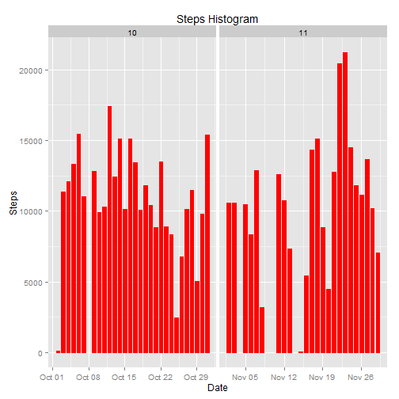

#Global Variables

```r
echo = TRUE
options(scipen = 1)
```
#First step:
##Loading and Processing the Data

```r
unzip("activity.zip")
```

```
## Warning in unzip("activity.zip"): error 1 in extracting from zip file
```

```r
data <- read.csv("activity.csv", colClasses = c("integer","Date","factor"))
data$month <- as.numeric(format(data$date, "%m"))
noNA <- na.omit(data)
rownames(noNA) <- 1:nrow(noNA)
head(noNA)
```

```
##   steps       date interval month
## 1     0 2012-10-02        0    10
## 2     0 2012-10-02        5    10
## 3     0 2012-10-02       10    10
## 4     0 2012-10-02       15    10
## 5     0 2012-10-02       20    10
## 6     0 2012-10-02       25    10
```

```r
dim(noNA)
```

```
## [1] 15264     4
```

```r
library(ggplot2)
```

#Question 1:
##What is the mean total number of steps taken per day?
###Make a histogram of the total number of  steps taken each day


```r
ggplot(noNA,aes(date, steps)) + geom_bar(stat="identity",colour = "red", fill = "red", width = 0.7) + facet_grid(.~month, scales="free")+labs(title = "Steps Histogram", x = "Date", y= "Steps")
```

 

```r
#Taking the mean
totalSteps <- aggregate(noNA$steps, list(Date=noNA$date), FUN = "sum")$x
mean(totalSteps)
```

```
## [1] 10766.19
```

```r
#Now the median
median(totalSteps)
```

```
## [1] 10765
```
#Question 2:
##What is the average daily activity pattern?
###Make a time-series plot of 5-minute intervals and the average number of steps.


```r
avgSteps <- aggregate(noNA$steps,list(interval=as.numeric(as.character(noNA$interval))),FUN="mean")
names(avgSteps)[2] <- "meanOfSteps"
ggplot(avgSteps,aes(interval, meanOfSteps)) + geom_line(color="steelblue", size=0.8) + labs(title = "Time Series Plot", x="5-minute intervals", y="Average Number of Steps")
```

 

```r
#Which interval had the maximum number of steps?
avgSteps[avgSteps$meanOfSteps == max(avgSteps$meanOfSteps), ]
```

```
##     interval meanOfSteps
## 104      835    206.1698
```

```r
#How many rows have NA?
sum(is.na(data))
```

```
## [1] 2304
```

```r
#Since it is not a good thing to have NA values for this analysis, I am going to sub in the value of the step mean for all NA.

updatedData <- data
for (i in 1:nrow(updatedData))
{
        if (is.na(updatedData$steps[i]))
        {
                updatedData$steps[i] <- avgSteps[which(updatedData$interval[i] == avgSteps$interval), ]$meanOfSteps
        }
}

head(updatedData)
```

```
##       steps       date interval month
## 1 1.7169811 2012-10-01        0    10
## 2 0.3396226 2012-10-01        5    10
## 3 0.1320755 2012-10-01       10    10
## 4 0.1509434 2012-10-01       15    10
## 5 0.0754717 2012-10-01       20    10
## 6 2.0943396 2012-10-01       25    10
```

```r
sum(is.na(updatedData))
```

```
## [1] 0
```

```r
#Make a histogram, and calculate the mean and median of the new data set
ggplot(updatedData, aes(date, steps)) + geom_bar(stat = "identity", colour = "green", fill = "green", width = 0.7) + facet_grid(.~month, scales = "free") + labs(title = "Histogram of Steps Taken Each Day with out Missing values", x = "Date", y = "Steps")
```

 

```r
#The new mean
newTotalSteps <- aggregate(updatedData$steps, list(Date = updatedData$date), FUN = "sum")$x
newMean <- mean(newTotalSteps)
newMean
```

```
## [1] 10766.19
```

```r
#The new median
newMedian <- median(newTotalSteps)
newMedian
```

```
## [1] 10766.19
```

```r
#Now let's compare them
oldMean <- mean(totalSteps)
oldMedian <- median(totalSteps)
newMean - oldMean
```

```
## [1] 0
```

```r
newMedian - oldMedian
```

```
## [1] 1.188679
```
##So after comparing these values, we can see that the NA values did not affect the mean but did actually affect the median. The new median is greater than the old median.

#Question 3:
##Are there differences in activity patterns between weekdays and weekends? (If this was me, it would be an absolute yes. I am definitely a weekend warrior.)

###The best way to approach this problem is create new variables that split the days into weekdays and weekends.


```r
head(updatedData)
```

```
##       steps       date interval month
## 1 1.7169811 2012-10-01        0    10
## 2 0.3396226 2012-10-01        5    10
## 3 0.1320755 2012-10-01       10    10
## 4 0.1509434 2012-10-01       15    10
## 5 0.0754717 2012-10-01       20    10
## 6 2.0943396 2012-10-01       25    10
```

```r
updatedData$weekdays <- factor(format(updatedData$date, "%A"))
levels(updatedData$weekdays)
```

```
## [1] "Friday"    "Monday"    "Saturday"  "Sunday"    "Thursday"  "Tuesday"  
## [7] "Wednesday"
```

```r
levels(updatedData$weekdays) <- list(weekday = c("Monday", "Tuesday", "Wednesday", "Thursday", "Friday"), weekend = c("Saturday", "Sunday"))
levels(updatedData$weekdays)
```

```
## [1] "weekday" "weekend"
```

```r
table(updatedData$weekdays)
```

```
## 
## weekday weekend 
##   12960    4608
```
###The next step is to create a panel plot containing a time series plot of the 5-minute interavls and average steps. Since we have already split the days into weekday and weekend, there will be two plots labeled accordingly.

```r
avgSteps <- aggregate(updatedData$steps, list(interval=as.numeric(as.character(updatedData$interval)),weekdays = updatedData$weekdays), FUN="mean")
names(avgSteps)[3] <- "meanOfSteps"
library(lattice)
xyplot(avgSteps$meanOfSteps ~ avgSteps$interval|avgSteps$weekdays, layout = c(1,2), type="1", xlab="Interval", ylab="Steps")
```

 
